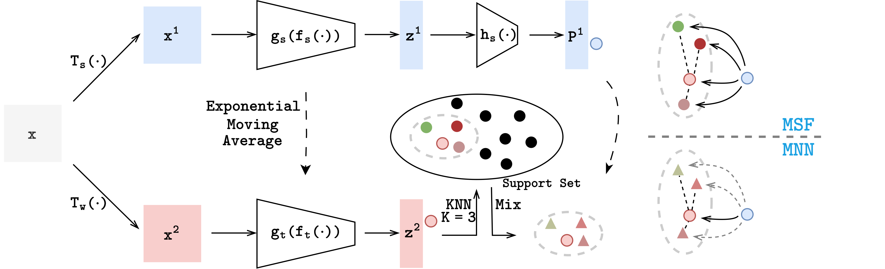

# MNN: Mixed Nearest Neighbors for Self-Supervised Learning

This is an PyTorch implementation of MNN proposed by our paper [MNN: Mixed Nearest-Neighbors for Self-Supervised Learning](https://arxiv.org/abs/2311.00562). If you find this repo useful, welcome 🌟🌟🌟✨.




## Requirements
To install requirements:
 ```setup
pip install -r requirements.txt
 ```

## Training and Evaluation
(You need to create the directory './pretrain_output' and './linear_eval_output')

The command line for training and evaluation is in **scripts.sh**

## Pre-trained Models

You can download pretrained models here:

- [this link](https://drive.google.com/drive/folders/1yw1NHU12aMdW5huIOstdvIk819HHQD8j?usp=sharing) trained on three datasets.
- Download and place in the **"./checkpoints"** directory

## Results

Our model achieves the following performance:

### Image Classification on four datasets

| -             | CIFAR-10  | CIFAR-100 | STL-10    | Tiny ImageNet |
|---------------|-----------|-----------|-----------|---------------|
| MSF           | 89.94     | 59.94     | 88.05     | 42.68         |
| **MNN(Ours)** | **91.47** | **67.56** | **91.61** | **50.70**     |


## Contributors and Contact
>📋  If there are any questions, feel free to contact with the authors.
