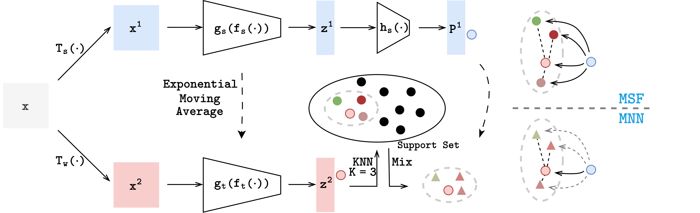

# MNN: Mixed Nearest Neighbors for Self-Supervised Learning

## Updata(12,Sep, 2024)
- **<font size=4>MNN has been accepted in PR(Pattern Recognition)!!</font>**.


This is an PyTorch implementation of MNN proposed by our paper [MNN: Mixed Nearest-Neighbors for Self-Supervised Learning](https://arxiv.org/abs/2311.00562). If you find this repo useful, welcome 🌟🌟🌟✨.



## Installation

Step 0. Download and install Miniconda from [official website](https://docs.anaconda.com/miniconda/)

Step 1. Create a conda environment and activate it
```shell
conda create --name mnn python=3.9 -y
conda activate mnn
```

Step 2. Install PyTorch following official instructions, e.g.
```shell
pip install -r requirements.txt
```

Step 3. Install MNN
```shell
git clone https://github.com/pc-cp/MNN
cd MNN
chmod +x ./scripts.sh
./scripts.sh
```


### Datasets:
- CIFAR10/CIFAR100: https://www.cs.toronto.edu/~kriz/cifar.html
- STL10: http://ai.stanford.edu/~acoates/stl10/stl10_binary.tar.gz
- Tiny ImageNet:  http://cs231n.stanford.edu/tiny-imagenet-200.zip

### The experimental environment in the manuscript

- Ubuntu 20.04.4 LTS (Focal Fossa)
- Python 3.9.7

## Pre-trained Models

You can download pretrained models here:

- [this link](https://drive.google.com/drive/folders/1yw1NHU12aMdW5huIOstdvIk819HHQD8j?usp=sharing) trained on three datasets.
- Download and place in the **"./checkpoints"** directory.

## Results

Our model achieves the following performance:

### Image Classification on four datasets

| -             | CIFAR-10  | CIFAR-100 | STL-10    | Tiny ImageNet |
|---------------|-----------|-----------|-----------|---------------|
| MSF           | 89.94     | 59.94     | 88.05     | 42.68         |
| **MNN(Ours)** | **91.47** | **67.56** | **91.61** | **50.70**     |


## Citation
If you find this repo useful for your research, please consider citing the paper

```
@article{LONG2025110998,
title = {MNN: Mixed nearest-neighbors for self-supervised learning},
journal = {Pattern Recognition},
volume = {158},
pages = {110998},
year = {2025},
issn = {0031-3203},
doi = {https://doi.org/10.1016/j.patcog.2024.110998},
url = {https://www.sciencedirect.com/science/article/pii/S0031320324007490},
author = {Xianzhong Long and Chen Peng and Yun Li}
```

## Contributors and Contact
>📋  If there are any questions, feel free to contact with the authors.
